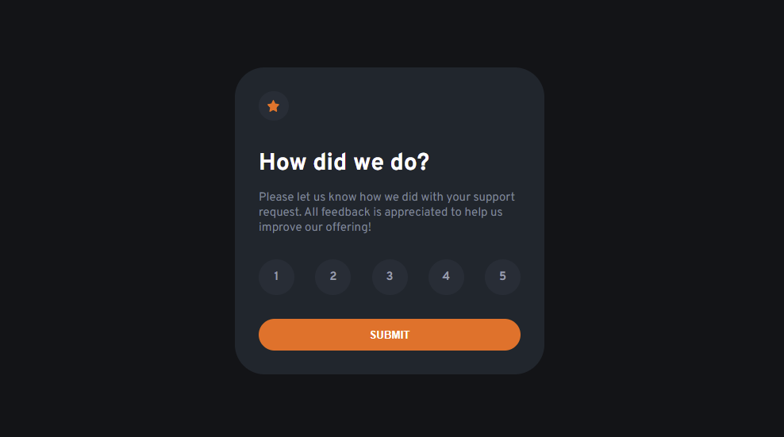

# Frontend Mentor - Interactive rating component solution

This is my solution to the [Interactive rating component challenge on Frontend Mentor](https://www.frontendmentor.io/challenges/interactive-rating-component-koxpeBUmI). Frontend Mentor challenges help you improve your coding skills by building realistic projects.

## Table of contents

- [Overview](#overview)
  - [The challenge](#the-challenge)
  - [Screenshot](#screenshot)
  - [Links](#links)
- [My process](#my-process)
  - [Built with](#built-with)

## Overview

### The challenge

Users should be able to:

- View the optimal layout for the app depending on their device's screen size
- See hover states for all interactive elements on the page
- Select and submit a number rating
- See the "Thank you" card state after submitting a rating

### Screenshot

### Links

- Solution URL: <https://www.frontendmentor.io/solutions/rating-component-built-with-sass-tNzN7_8htn>
- Live Site URL: <https://02-interactive-rating-component.netlify.app/>

## My process

### Built with

- Sass
